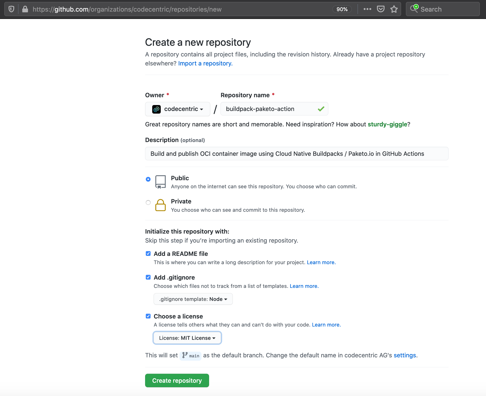

# custom-github-action
Project showing how to create &amp; use your own GitHub Action


## 1. Create a custom GitHub Action

In order to reuse GitHub Actions workflow snippets let's create a custom GitHub Action (see https://docs.github.com/en/actions/creating-actions/about-actions).

As we need some sort of example, let's use the https://github.com/jonashackt/spring-boot-buildpack project, which uses the following [GitHub Action workflow](https://github.com/jonashackt/spring-boot-buildpack/blob/main/.github/workflows/build.yml) - which is also referred to on stackoverflow https://stackoverflow.com/questions/66598692/cache-cloud-native-buildpacks-paketo-io-pack-cli-builds-on-github-actions-e-g/66598693#66598693:

```yaml
name: build

on: [push]

jobs:
  build-with-paketo-push-2-dockerhub:
    runs-on: ubuntu-latest
    steps:
      - uses: actions/checkout@v2

      - name: Login to DockerHub Container Registry
        run: echo $DOCKER_HUB_TOKEN | docker login -u jonashackt --password-stdin
        env:
          DOCKER_HUB_TOKEN: ${{ secrets.DOCKER_HUB_TOKEN }}

      - name: Install pack CLI via the official buildpack Action https://github.com/buildpacks/github-actions#setup-pack-cli-action
        uses: buildpacks/github-actions/setup-pack@v4.1.0

      - name: Build app with pack CLI using Buildpack Cache image (see https://buildpacks.io/docs/app-developer-guide/using-cache-image/) & publish to Docker Hub
        run: |
          pack build index.docker.io/jonashackt/spring-boot-buildpack:latest \
              --builder paketobuildpacks/builder:base \
              --path . \
              --cache-image index.docker.io/jonashackt/spring-boot-buildpack-paketo-cache-image:latest \
              --publish
```

So the idea is to create a custom GitHub Action that does all the 3 steps of logging into a container registry, installing Paketo.io pack CLI and building with pack CLI in one step.


### Create GitHub repository for your GitHub Action

Therefore let's create a new repository for our GitHub Action:



Now we clone the repo and create a action metadata file. But how to...


### Do multiple steps inside one Action

There's the `composite run steps action` feature https://docs.github.com/en/actions/creating-actions/creating-a-composite-run-steps-action, which was announced here https://github.com/actions/runner/issues/646:

> We’ve also heard from our community that many developers want to reuse parts of their workflows into other workflows. This new action type, composite run steps, can help developers do just that!

So using multiple steps inside one Action could be achieved using the `using: "composite"` configuration parameter inside an Action:

```yaml
runs:
  using: "composite"
  steps:
    - run: echo Hello ${{ inputs.who-to-greet }}.
      shell: bash
    - run: ${{ github.action_path }}/goodbye.sh
      shell: bash
```


### Reuse an Action from a custom Action?

https://stackoverflow.com/questions/58860769/call-a-github-action-from-another-github-action

https://stackoverflow.com/questions/58611841/how-can-i-reference-other-actions-from-my-github-actions-action-yml-file

This feature is still under development and should be released somewhere in 2021:

https://github.com/actions/runner/issues/646

> So right now, we can reuse other Actions inside our Action :(


### Create action.yml

Let's finally create the `action.yml` (see https://docs.github.com/en/actions/creating-actions/creating-a-composite-run-steps-action#creating-an-action-metadata-file):

```yaml
name:        'Paketo Build with pack CLI & push to registry'
description: 'Build and publish OCI container image using Cloud Native Buildpacks / Paketo.io in GitHub Actions'
author:      'jonas.hecht@codecentric.de'

inputs:
  pack-version:
    description: 'The version of pack to install'
    required:    false
    default:     '0.17.0'

runs:
  using: "composite"
  steps:
    # Reusing the great pack CLI installation from https://github.com/buildpacks/github-actions/blob/main/setup-pack/action.yml
    # As of https://github.com/actions/runner/issues/646 we can't simply reuse the Action, but if thats possible, we should do it :)
    - name: Setup pack CLI
      shell: bash
      run:   |
        #!/usr/bin/env bash
        set -euo pipefail
        mkdir -p "${HOME}"/bin
        echo "PATH=${HOME}/bin:${PATH}" >> "${GITHUB_ENV}"
        PACK_VERSION=${{ inputs.pack-version }}
        echo "Installing pack ${PACK_VERSION}"
        curl \
          --show-error \
          --silent \
          --location \
          "https://github.com/buildpacks/pack/releases/download/v${PACK_VERSION}/pack-v${PACK_VERSION}-linux.tgz" \
        | tar -C "${HOME}/bin" -xz pack
    - name: Say hello
      shell: bash
      run: echo "pack CLI is ready now!"
```

### Releasing and Testing our Action 

https://docs.github.com/en/actions/creating-actions/about-actions#choosing-a-location-for-your-action


## How to reuse GitHub Action workflows - or have private Actions

GitHub Actions Centrally managed workflow templates feature: https://github.com/github/roadmap/issues/98

https://stackoverflow.com/questions/60544181/how-to-us-snippets-in-github-action-workflow-file-to-avoid-duplicates

Why not use the actions/checkout Action to checkout the repository itself - and then also another repository containing an Action

https://github.com/actions/checkout#checkout-multiple-repos-side-by-side


and then use https://docs.github.com/en/actions/creating-actions/about-actions#choosing-a-location-for-your-action

with

> If you're building an action that you don't plan to make available to the public, you can store the action's files in any location in your repository. If you plan to combine action, workflow, and application code in a single repository, we recommend storing actions in the .github directory. For example, .github/actions/action-a and .github/actions/action-b.

```
jobs:
  my_first_job:
    steps:
		- name: Checkout
		  uses: actions/checkout@v2
		  with:
		    path: main

		- name: Checkout tools repo
		  uses: actions/checkout@v2
		  with:
		    repository: my-org/my-tools
		    path: my-tools

		- name: Use local my-action
		uses: ./.github/actions/my-action

```